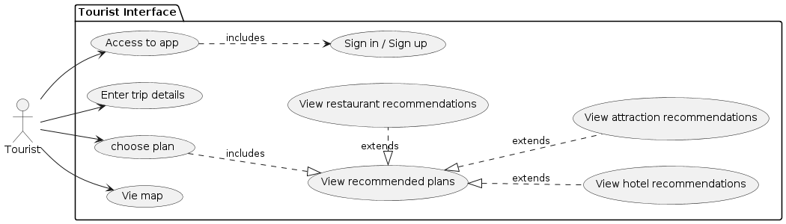
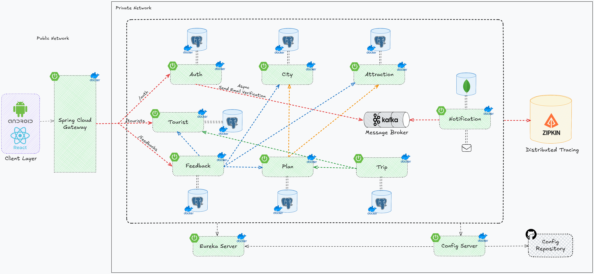
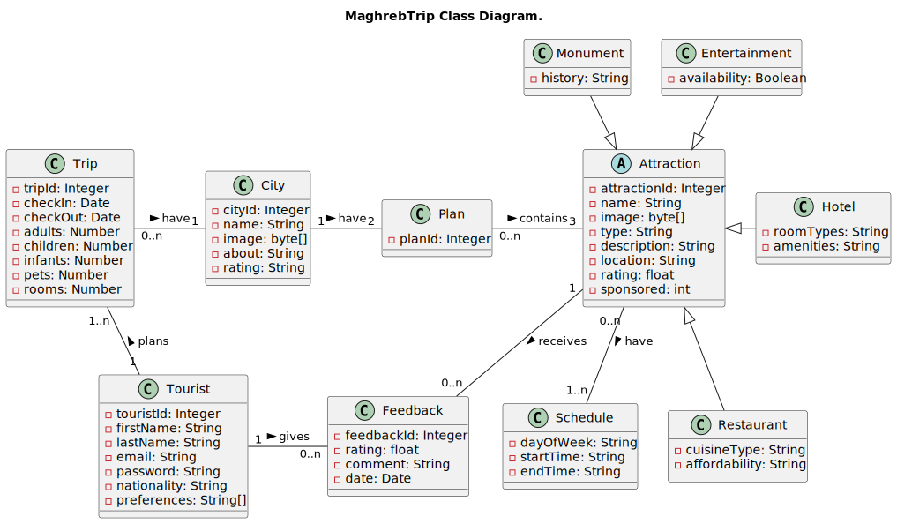

# MaghrebTrip: Web Application for Personalized Travel Planning in Morocco

## Introduction

MaghrebTrip is a web application designed to assist tourists during their trips to Morocco by organizing their activities. Users input information about their arrival and departure dates, as well as the cities they wish to visit. The application then generates a daily itinerary, suggesting key monuments and notable places based on the user's interests. MaghrebTrip also provides recommendations for hotels and restaurants. These establishments have dedicated sections where they can add information about the services they offer. Additionally, they have the option to sponsor the application for increased visibility, offering competitive rates that suit their preferences.

## Team Members

* **[Ahmed IDRISSI](https://github.com/ahmedidrissi)**
* **[Ahmed LAZRAK](https://github.com/laze03)**
* **[Fatima Ezzahra BRAIKAT](https://github.com/fatibr19)**
* **[Hiba MEKKAOUI](https://github.com/HM2811)**

## Application requirements

In this section, both functional and non-functional requirements will be outlined to comprehensively delineate the system's operational and performance parameters.

### Functional Requirements

1. **User Registration and Authentication:**

   - Users should be able to register for an account and log in securely.
   - Authentication mechanisms should ensure the security of user accounts.

2. **Trip Planning:**

   - Users should be able to input their arrival date, departure date, and cities they plan to visit.
   - The app should generate a personalized itinerary/schedule for each user's trip, including recommended attractions, hotels, and restaurants.

3. **Attraction Recommendations:**

   - The app should provide recommendations for attractions (monuments, landmarks, etc.) in each city based on user preferences and interests.

4. **Hotel and Restaurant Recommendations:**

   - Users should be able to view recommended hotels and restaurants in each city, with details such as location, pricing, amenities, and cuisine.

5. **Sponsorship Management:**

   - Hotels and restaurants should be able to create accounts and manage their sponsorship details, including payment information and sponsorship duration.

6. **Feedback and Ratings:**
   - Users should be able to provide feedback and ratings for hotels and restaurants they visit, contributing to the overall rating and reputation of each establishment.

### Non-Functional Requirements

1. **Performance:**

   - The app should be responsive and provide quick recommendations and itinerary generation, even during peak usage times.

2. **Scalability:**

   - The app should be able to handle a growing number of users, attractions, hotels, and restaurants without compromising performance.

3. **Security:**

   - User data should be encrypted and stored securely to protect user privacy.
   - Access to sensitive information should be restricted based on user roles and permissions.

4. **Usability:**

   - The user interface should be intuitive and user-friendly, allowing users to navigate the app easily and find relevant information quickly.

5. **Reliability:**

   - The app should be stable and reliable, with minimal downtime and errors.
   - Data integrity should be maintained to ensure the accuracy of trip plans and recommendations.

6. **Accessibility:**

   - The app should be accessible to users with disabilities, following accessibility standards and guidelines.

7. **Compatibility:**

   - The app should be compatible with a variety of devices and web browsers to ensure a seamless user experience across different platforms.

8. **Localization:**
   - The app should support multiple languages and currencies to accommodate users from different regions.

## Use Cases

1. **Tourist Actor**

<p align="center">
  
  <br/>
  <p align="center" >Figure 5: Tourist Use Case Diagram</p>
</p>

<br/>

## System design

1. **System Architecture**

<p align="center">
  
  <br/>
  <p align="center" >Figure 1: System Architecture</p>
</p>

2. **Class Diagram**

<p align="center">
  
  <br/>
  <p align="center" >Figure 5: Class Diagram</p>
</p>

<br/>

## Technologies and Tools

1. **Development:**
* Server: Spring Boot, Eureka, Feign
* Web: React.js
* Mobile: Android Studio
* Database: PostgreSQL, MySQL, Firebase

2. **Mapping API:**
* Foursquare API: To obtain information about places to visit.
* Google Maps Platform: For city map editing and navigation.

3. **Scrapping:**
* Python: For web scrapping to obtain information about hotels and restaurants.

4. **Version Control:**
* Git/GitHub: For tracking changes and collaboration.

5. **CI/CD:**
* Docker: Containerization of the application to ensure portability and consistency across environments.
* GitHub Actions: Native integration with GitHub repositories, facilitating CI/CD pipeline configuration.

6. **Deployment:**
* AWS EC2: Elastic Compute Cloud for hosting the application.

## Project Management

1. **Methodology:**
* Agile: Iterative and incremental development approach, enabling flexibility and adaptability to changing requirements.


## Development Guidelines (for the team)

1. **Dockerize a microservice:**

- In Dockerfile:

```dockerfile
FROM openjdk:17-jdk-alpine
LABEL com.maghrebtrip.[microservice]="beta"
COPY target/[microservice].jar [microservice].jar
ENTRYPOINT ["java","-jar","/[microservice].jar"]
```

- Install feign-clients

```bash
cd feign-clients
mvn clean install
```

- Package the microservice

```bash
cd [microservice]
mvn clean package
```

- Build the docker image

```bash
docker build --tag=maghrebtrip/[microservice]:latest .
```

- Run the docker container

```bash
docker run -p [port]:[port] maghrebtrip/[microservice]:latest
```

## Conclusion

MaghrebTrip is a comprehensive travel planning application designed to enhance the tourist experience in Morocco. By providing personalized itineraries, attraction recommendations, and sponsorship opportunities, the app aims to streamline travel arrangements and promote local businesses. The system design and development guidelines outlined in this document offer a roadmap for the project's implementation, ensuring a robust and user-friendly application that meets the needs of tourists and businesses alike.

## References

1. [Spring Boot Documentation](https://spring.io/projects/spring-boot)
2. [React.js Documentation](https://reactjs.org/)
3. [Android Studio Documentation](https://developer.android.com/studio)
4. [PostgreSQL Documentation](https://www.postgresql.org/docs/)
5. [MySQL Documentation](https://dev.mysql.com/doc/)
6. [Firebase Documentation](https://firebase.google.com/docs)
7. [Foursquare API Documentation](https://developer.foursquare.com/docs/api)
8. [Google Maps Platform Documentation](https://developers.google.com/maps)
9. [Docker Documentation](https://docs.docker.com/)
10. [GitHub Actions Documentation](https://docs.github.com/en/actions)
11. [AWS EC2 Documentation](https://docs.aws.amazon.com/ec2/)
