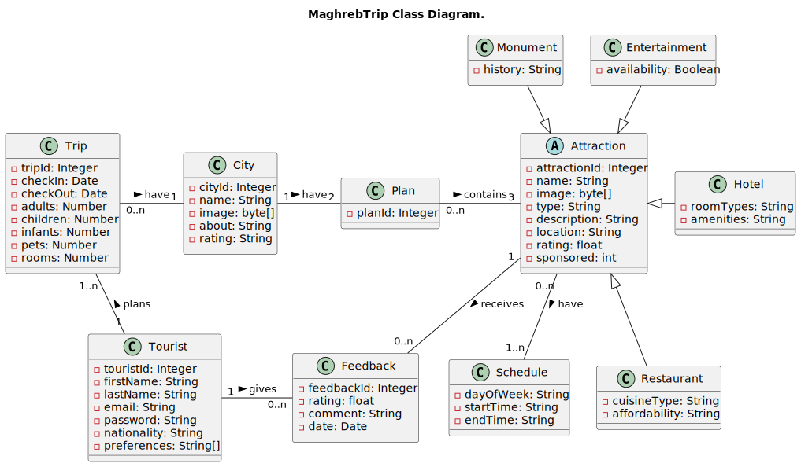
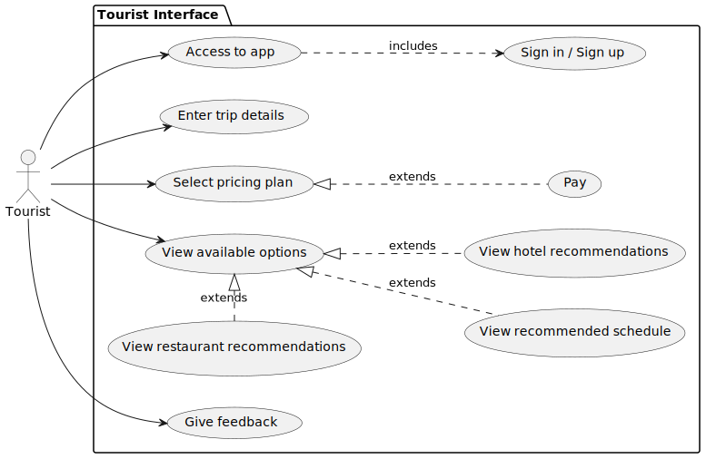
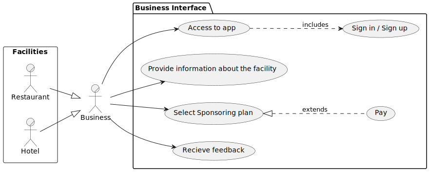

# MaghrebTrip: Web Application for Personalized Travel Planning in Morocco

## Introduction

MaghrebTrip is a web application designed to assist tourists during their trips to Morocco by organizing their activities. Users input information about their arrival and departure dates, as well as the cities they wish to visit. The application then generates a daily itinerary, suggesting key monuments and notable places based on the user's interests. MaghrebTrip also provides recommendations for hotels and restaurants. These establishments have dedicated sections where they can add information about the services they offer. Additionally, they have the option to sponsor the application for increased visibility, offering competitive rates that suit their preferences.

## Mock-up

Enclosed are mock-up screenshots of MaghrebTrip, illustrating the planned trip planning interface. These visuals offer insight into the platform's functionality, showcasing its capability to facilitate efficient travel arrangements.

Homepage: Serves as the initial landing page for MaghrebTrip, offering an informative overview of the application's features and benefits, encouraging user engagement.

<p align="center">
  
  <br/>
  <p align="center" >Picture 1: MaghrebTrip Homepage</p>
</p>

<br/>

Login Page: Facilitates secure access for registered users, requiring authentication via email and password to ensure data privacy and account security.

<p align="center">
  
  <br/>
  <p align="center" >Picture 2: MaghrebTrip Log In page</p>
</p>

<br/>

Sign In Page: Provides a streamlined process for new users to create accounts, guiding them through the registration process with clear prompts and ensuring accurate user information for future authentication.

<p align="center">
  
  <br/>
  <p align="center" >Picture 3: MaghrebTrip Sign In page</p>
</p>

<br/>

Trip Planning Page: Authenticated users input arrival/departure dates, select cities, and receive personalized itineraries with recommended destinations for a seamless travel experience.

<p align="center">
  
  <br/>
  <p align="center" >Picture 4: MaghrebTrip Selection page</p>
</p>

<br/>

## Application requirements

In this section, both functional and non-functional requirements will be outlined to comprehensively delineate the system's operational and performance parameters.

### Functional Requirements

1. **User Registration and Authentication:**

   - Users should be able to register for an account and log in securely.
   - Authentication mechanisms should ensure the security of user accounts.

2. **Trip Planning:**

   - Users should be able to input their arrival date, departure date, and cities they plan to visit.
   - The app should generate a personalized itinerary/schedule for each user's trip, including recommended attractions, hotels, and restaurants.

3. **Attraction Recommendations:**

   - The app should provide recommendations for attractions (monuments, landmarks, etc.) in each city based on user preferences and interests.

4. **Hotel and Restaurant Recommendations:**

   - Users should be able to view recommended hotels and restaurants in each city, with details such as location, pricing, amenities, and cuisine.

5. **Sponsorship Management:**

   - Hotels and restaurants should be able to create accounts and manage their sponsorship details, including payment information and sponsorship duration.

6. **Feedback and Ratings:**
   - Users should be able to provide feedback and ratings for hotels and restaurants they visit, contributing to the overall rating and reputation of each establishment.

### Non-Functional Requirements

1. **Performance:**

   - The app should be responsive and provide quick recommendations and itinerary generation, even during peak usage times.

2. **Scalability:**

   - The app should be able to handle a growing number of users, attractions, hotels, and restaurants without compromising performance.

3. **Security:**

   - User data should be encrypted and stored securely to protect user privacy.
   - Access to sensitive information should be restricted based on user roles and permissions.

4. **Usability:**

   - The user interface should be intuitive and user-friendly, allowing users to navigate the app easily and find relevant information quickly.

5. **Reliability:**

   - The app should be stable and reliable, with minimal downtime and errors.
   - Data integrity should be maintained to ensure the accuracy of trip plans and recommendations.

6. **Accessibility:**

   - The app should be accessible to users with disabilities, following accessibility standards and guidelines.

7. **Compatibility:**

   - The app should be compatible with a variety of devices and web browsers to ensure a seamless user experience across different platforms.

8. **Localization:**
   - The app should support multiple languages and currencies to accommodate users from different regions.

## System design

The ensuing section features conceptual UML diagrams illustrating the structural and behavioral aspects of the system. These diagrams offer visual insights into the system's components, their interconnections, and operational flow. They provide a clear framework for understanding the system's design and functionality, aiding in the development process.

1. **Class Diagram**

The class diagram depicts the static structure of the system, showcasing the various classes, their attributes, and the relationships among them. It serves as a blueprint for understanding the entities within the system and their interactions, laying the foundation for implementation and further development.

<p align="center">
  
  <br/>
  <p align="center" >Figure 5: Class Diagram</p>
</p>

<br/>

2. **Tourist Use Case Diagram**

The tourist use case diagram illustrates the various interactions between the system and its users, specifically focusing on the actions and goals of tourists interacting with the system. It outlines the different functionalities and services offered to tourists, providing a high-level overview of their interactions with the system to achieve specific tasks or objectives during their visit.

<p align="center">
  
  <br/>
  <p align="center" >Figure 5: Tourist Use Case Diagram</p>
</p>

<br/>

1. **Business Use Case Diagram**

The business use case diagram provides a comprehensive overview of the system's functionalities from a business perspective. It delineates the various tasks or goals that different actors within the business domain aim to accomplish using the system.

<p align="center">
  
  <br/>
  <p align="center" >Figure 5: Business Use Case Diagram</p>
</p>

<br/>


## Dev

1. Dockerize a microservice:

- In Dockerfile:

```dockerfile
FROM openjdk:17-jdk-alpine
LABEL com.maghrebtrip.[microservice]="beta"
COPY target/[microservice].jar [microservice].jar
ENTRYPOINT ["java","-jar","/[microservice].jar"]
```

- Install feign-clients

```bash
cd feign-clients
mvn clean install
```

- Package the microservice

```bash
cd [microservice]
mvn clean package
```

- Build the docker image

```bash
docker build --tag=maghrebtrip/[microservice]:latest .
```
